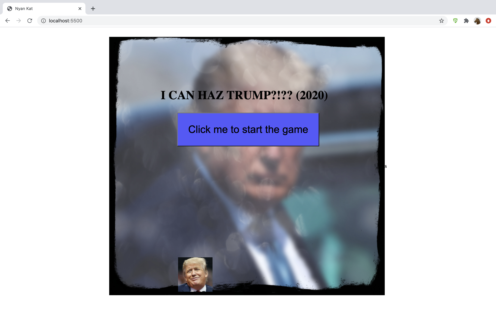
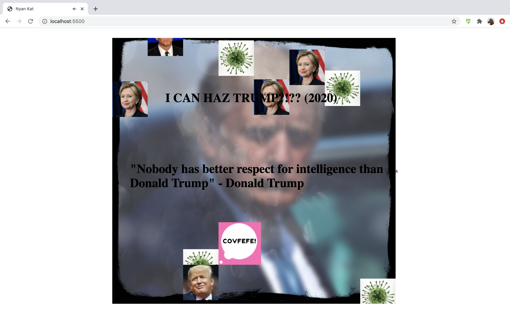

# Object Oriented Programming Game Project

# I CAN HAZ TRUMP!

### Screen shot of the game before the start button is pressed

### Screen shot in the middle of the game - showing the player has moved up the game

### Screen shot of the game once the player has lost

## List of game modifications

- A start button now starts the game. Once the player has been killed, the button appears on the screen after 2.5 seconds so the game can be re-started (main.js).

- The player is now able to move both up and down as well as left and right (Player.js and main.js).

- The new enemies appear in the game according to their speed (Enemy.js).

- The overall speed of the game was changed so that the enemies fall more slowly until halfway down the game where they fall very fast until the bottom of the game (Enemy.js).

- The game was fixed so that the game ends when the player collides with an enemy (Engine.js).

- Once the player has been killed a speech bubble appears on the screen for 2.5 seconds. The speech bubble moves with the player so always appears to the right of the player. This disappears once the start button re-appears (Engine.js and Player.js).

- Once the player has been killed an audio sound plays for 2.5 seconds (Engine.js).

- Once the player has been killed text appears on the screen for 2.5 seconds. This disappears once the start button re-appears (Text.js and Engine.js).

- Text was added in the form of a title to the page (Text.js and main.js).

- The overall game size was increased (data.js).

- The background image was changed (engine-utilities.js).

- The number of enemies was increased from 5 to 8 (engine-utilities.js).

- The enemy image was replaced by a number of different enemy images and the size of the enemies increased (Enemy.js and data.js).

- The player was replaced with a different image and the size of the player increased (Player.js and data.js).

### Submission

- Open a PR, as you normally would, against the parent repository.
- Be sure to add screenshot(s) to the PR.
- Deploy the project to Netlify
  - View this guide: https://docs.google.com/document/d/1J7ff9h77RMrQadgCM54eziW_Rj5_PAHYpQHYjf2ojZU/edit?usp=sharing

### DUE DATE

Your project is due on XX XXX, XXXX by XX:XX.

## Useful Links

- https://javascript.info/keyboard-events
